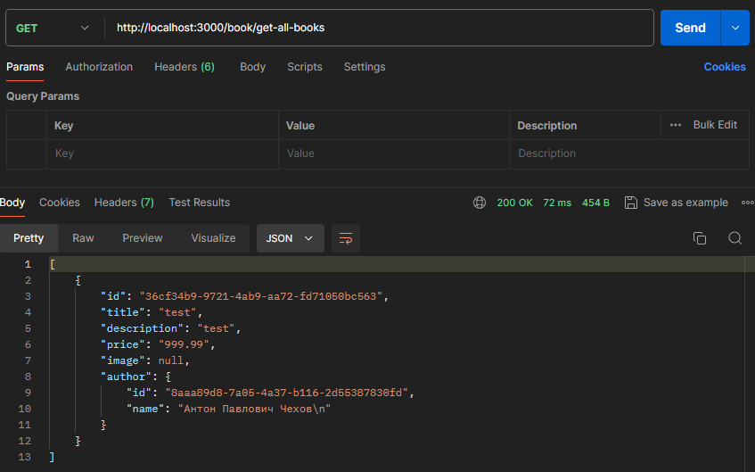

Add to book entity author and image

## Description

- Refactored the application architecture to Domain-Driven Design.
- Added a new entity 'Author' with columns 'id' and 'name'.
- Modified the 'Book' entity, added new columns: 'image', 'author' which fetches data from the 'authors' table.

Postman

